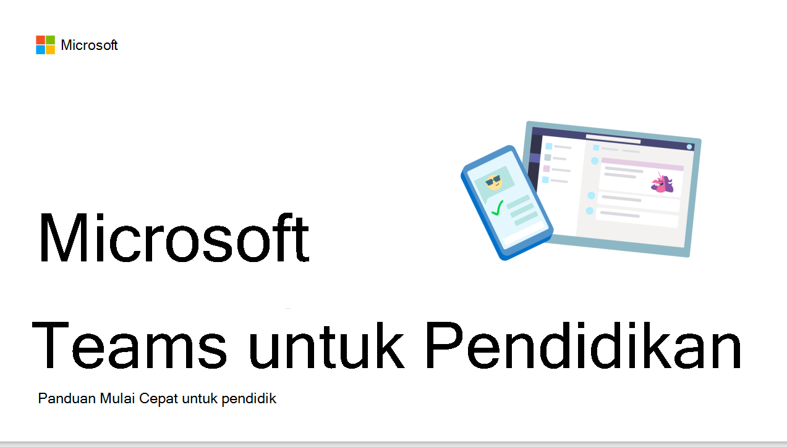
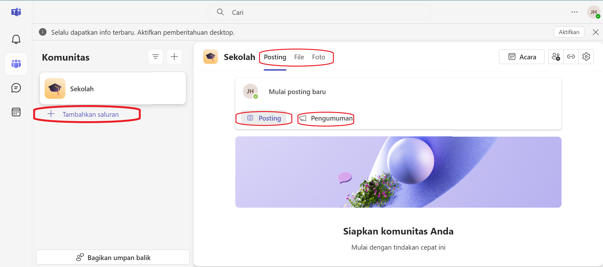
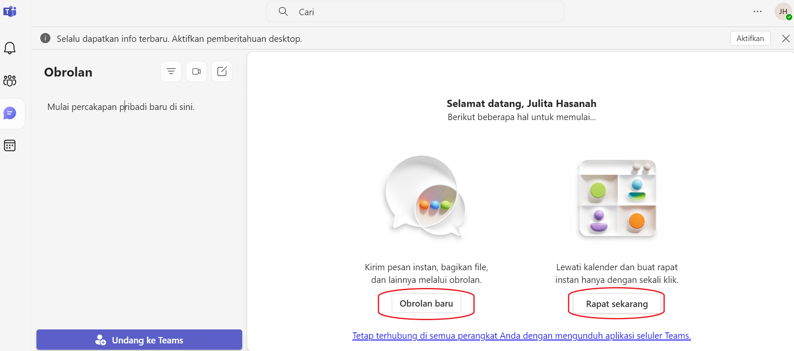
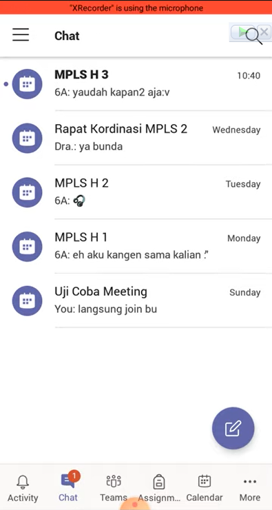

> Nama : Julita Hasanah  
> Nim : 2110131120005

  

<h1 align="center"><b>Review Aplikasi/Software as Tutor, Tools, dan Tutee</b> </h1>

<h1 align="center">Microsoft Teams for Education </h1>

  

Microsoft Teams adalah platform kolaborasi digital yang menyediakan berbagai fitur untuk mendukung pengajaran dan pembelajaran dalam satu aplikasi.Selain itu pengguna dapat melakukan pengeditan pada sebuah dokumen langsung secara bersamaan tanpa membuka aplikasi lain. Sehingga semua terpusat dalam satu tempat. Microsoft Teams dalam dunia pendidikan dijadikan sebagai alat untuk merancang kelas virtual yang memudahkan guru dan siswa, antar guru/antar siswa berkomunikasi dan berkolaborasi menghasilkan keluaran pembelajaran yang lebih baik. 
Beberapa opsi Teams yang dapat disesuaikan dengan perangkat yang dimiliki, yaitu versi web, dekstop, dan mobile. Microsoft Teams berfungsi sebagai ruang kelas virtual yang mengintegrasikan kemampuan komunikasi, kolaborasi, manajemen tugas, dan alat bantu pembelajaran, sehingga dapat berperan sebagai tutor, tools, dan tutee.

1. **Microsoft Teams sebagai Tutor (Pengajar)**  
   Sebagai tutor, Microsoft Teams memungkinkan pengajar untuk:  
     

- **Membuat Ruang Kelas Virtual**: Pengajar dapat membuat tim kelas untuk setiap mata pelajaran atau kelompok siswa. Setiap tim ini berfungsi sebagai ruang kelas virtual tempat materi dibagikan, tugas diberikan, dan komunikasi dilakukan.
- **Mengelola Materi Pembelajaran**: Pengajar dapat mengunggah materi pelajaran seperti dokumen, presentasi, video, dan tautan eksternal. File tersebut bisa diatur dalam folder di dalam channel untuk setiap mata pelajaran atau topik.
- **Memberikan Tugas dan Penilaian**: Microsoft Teams memungkinkan pengajar untuk membuat, mendistribusikan, dan menilai tugas siswa. Pengajar dapat menetapkan tenggat waktu, menggunakan rubrik penilaian, dan memberikan umpan balik secara langsung melalui aplikasi.
- **Komunikasi dan Interaksi**: Fitur chat, panggilan video, dan rapat memungkinkan komunikasi dan interaksi antara pengajar dan siswa, baik secara individu maupun kelompok. Pengajar dapat melakukan diskusi kelas, tanya jawab, dan memberikan bimbingan tambahan melalui rapat video.
    

- **Integrasi dengan OneNote Class Notebook**: Fitur ini memungkinkan pengajar untuk membuat catatan digital yang dapat diakses dan dibagikan dengan siswa. Pengajar dapat memberikan materi pelajaran, latihan, dan catatan untuk membantu proses belajar mengajar
- **Manajemen Kehadiran dan Analisis Aktivitas Siswa**: Pengajar dapat melacak kehadiran siswa dalam rapat kelas virtual dan menganalisis partisipasi serta keterlibatan siswa melalui aktivitas yang tercatat di Microsoft Teams.

 

2. **Microsoft Teams sebagai Tools (Alat Bantu)**  

Sebagai tools, Microsoft Teams menyediakan berbagai alat yang mendukung proses pembelajaran:

- Integrasi dengan Microsoft Office 365: Pengguna dapat mengakses Word, Excel, PowerPoint, OneNote, dan aplikasi Microsoft lainnya langsung dari Teams. Hal ini memudahkan pengelolaan materi dan penyusunan tugas.
- Papan Tulis Digital (Whiteboard): Teams menyediakan fitur Whiteboard yang dapat digunakan selama rapat atau kelas virtual untuk menjelaskan konsep secara visual.
- Alat Evaluasi dan Kuis: Pengajar dapat membuat kuis dan survei menggunakan Microsoft Forms yang terintegrasi dengan Teams, untuk mengevaluasi pemahaman siswa atau mengumpulkan umpan balik.
- Kanal (Channels) untuk Kolaborasi: Teams memungkinkan pengajar dan siswa untuk membuat channel khusus untuk setiap proyek, topik, atau kelompok diskusi. Ini memungkinkan kolaborasi yang lebih terfokus dengan berbagi file, diskusi, dan aktivitas lainnya.
- Add-ins dan Integrasi Aplikasi Pihak Ketiga: Teams mendukung integrasi dengan berbagai aplikasi pendidikan dan alat bantu lainnya seperti Kahoot!, Quizlet, dan Flipgrid, yang dapat meningkatkan interaktivitas dan keterlibatan siswa.
- File Sharing dan Cloud Storage: Teams menyediakan penyimpanan cloud melalui OneDrive untuk berbagi file dan dokumen antar anggota kelas, sehingga materi dapat diakses kapan saja dan di mana saja.

 

3. **Microsoft Teams sebagai Tutee (Pelajar)**  
   Sebagai tutee, Microsoft Teams memungkinkan siswa untuk:  
<<<<<<< HEAD
     
=======
       
>>>>>>> 1497ce6283ab1c6968af1e1cf60ebb1b848dcfe3

- Mengakses Materi Pembelajaran dan Tugas: Siswa dapat mengakses materi yang diunggah oleh pengajar, termasuk buku teks digital, presentasi, catatan, dan video. Mereka juga dapat melihat tugas yang diberikan, mengerjakan tugas, dan mengirimkannya kembali kepada pengajar.
- Berpartisipasi dalam Diskusi Kelas dan Kelompok: Siswa dapat berpartisipasi aktif dalam diskusi kelas melalui chat atau panggilan video. Mereka juga dapat bergabung dengan channel yang relevan untuk berdiskusi atau bekerja pada proyek kelompok.
- Mendapatkan Umpan Balik dan Penilaian: Siswa dapat menerima umpan balik dan penilaian dari tugas yang mereka kirimkan melalui platform. Mereka juga dapat melihat rubrik penilaian yang digunakan oleh pengajar.
- Mengelola Jadwal dan Kegiatan: Dengan kalender bawaan di Microsoft Teams, siswa dapat melihat jadwal kelas, tenggat waktu tugas, dan rapat mendatang. Ini membantu mereka mengatur waktu dan mengelola kegiatan belajar mereka.
- Belajar Secara Mandiri atau Kolaboratif: Siswa dapat belajar secara mandiri dengan mengakses materi pelajaran dan mengerjakan tugas di waktu mereka sendiri. Mereka juga bisa bekerja sama dengan teman sekelas pada proyek atau tugas kelompok.

- Mencari Bantuan dan Berkomunikasi dengan Pengajar: Siswa dapat menghubungi pengajar mereka untuk klarifikasi atau pertanyaan tambahan terkait materi pelajaran atau tugas melalui chat atau video call. 
<<<<<<< HEAD
    
=======
      

## **Kesimpulan**

Microsoft Teams adalah platform komprehensif yang mengintegrasikan berbagai fungsi pembelajaran dan manajemen kelas, yang membuatnya mampu memenuhi kebutuhan pengajar, siswa, dan alat bantu pembelajaran dalam satu aplikasi. Dengan berbagai fitur kolaborasi, pengelolaan kelas, dan integrasi dengan aplikasi Microsoft lainnya, Teams adalah pilihan yang sangat fleksibel untuk pembelajaran di sekolah, universitas, maupun di lingkungan korporat.

>>>>>>> 1497ce6283ab1c6968af1e1cf60ebb1b848dcfe3
